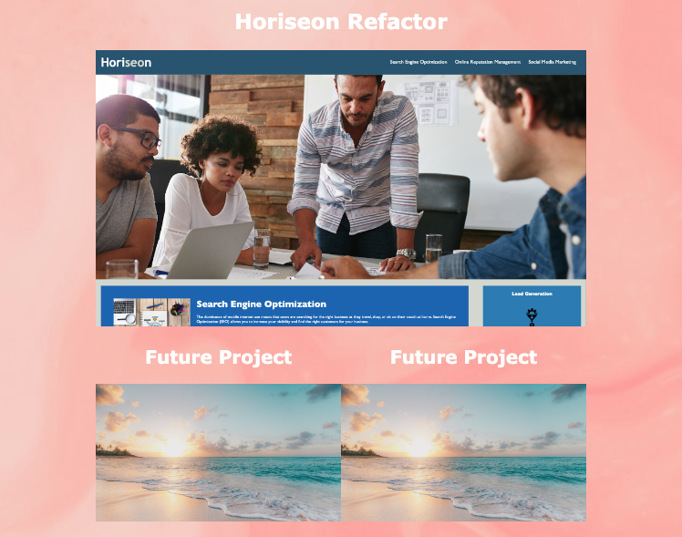

# Portfolio

## Description

This portfolio was created and designed using the skills I've learned in bootcamp so far. Its purpose is to display my skill set. It is built with the intention of adding more projects as I advance in bootcamp. This project taught me how to build an HTML and CSS file from scratch, how to organize code, how to avoid redundancy in CSS, how to add media queries and more.

## Installation

To deploy the portfolio, visit the project repository on GitHub > Settings > Pages > Source > Branch (main) > Save. From here you can view the finished project on GitHub Pages. You can view it via GitHub Pages here: https://camillebagnani.github.io/portfolio/

## Usage

This project is intended to be used as a portfolio of projects that I complete throughout bootcamp. The 'Projects' section is designed to allow additional projects to be linked once I complete them. The placeholder titles 'Future Project' and images of the beach will be switched to relevant titles and screenshots of the future projects.

## Credits

Background image: https://unsplash.com/photos/blue-and-white-water-surface-KarT442iSUk

Beach image: https://unsplash.com/photos/seashore-during-golden-hour-KMn4VEeEPR8

## License

n/a